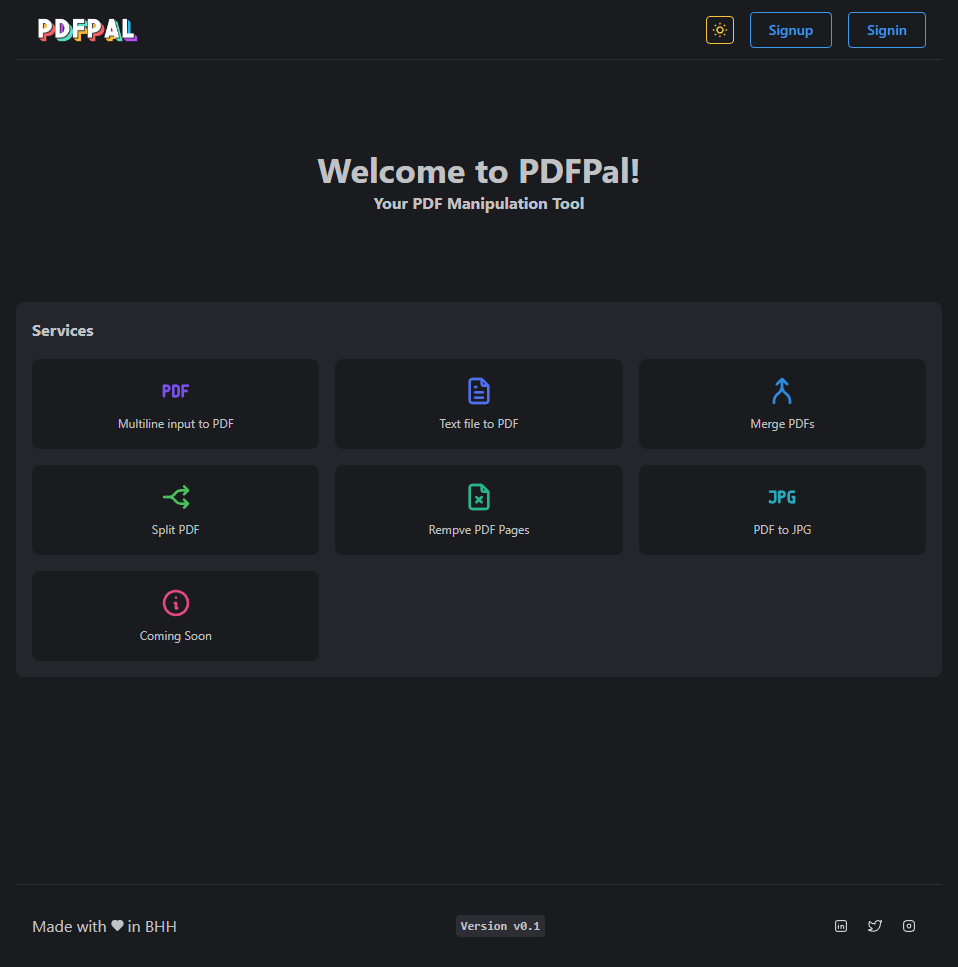
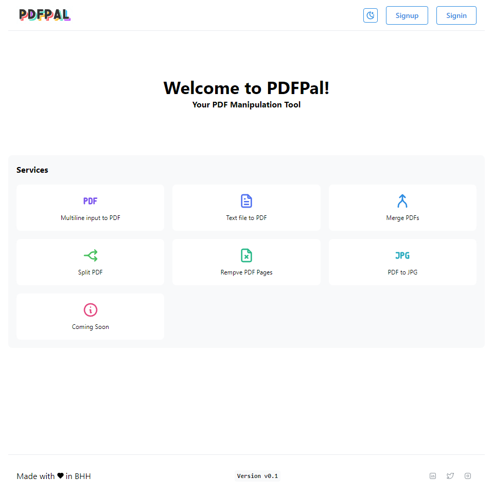

# PDFPal frontend project
### The final project of Single Page Application module
This is only the frontend of PDFPal project.
After the next DCI module I'm going to make this a complete working pdf manipulation web app.

#### Live demo:
- [pdfpal.com](https://pdfpal.app/)

#### Tech stack used in this project:
- [React](https://reactjs.org/)
- [React Router](https://reactrouter.com/en/main)
- [Mantine ui](https://mantine.dev/)
- [Mantine components](https://ui.mantine.dev/)
- [Typescript](https://www.typescriptlang.org/)

#### Other tools used in this project:
- [logoai.com](https://www.logoai.com/logo-maker) - an AI based logo generator which was used to create the logo
- [@tabler/icons-react](https://tabler-icons.io/) - this library is used to for the SVGs

#### Deployed in:
- [Vercel](https://vercel.com/)

#### A note about using this project:
- Although you can start this project with `npm start` but it's not recommended. 
- So please make sure to start this project only wih `yarn start`

#### Licence: 
- MIT - So all contributions are most welcome! 🙂

#### Screenshots:

